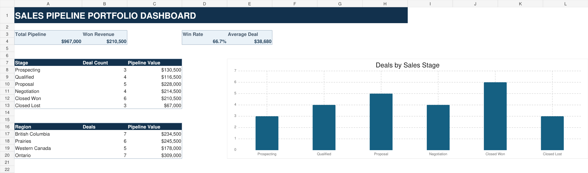

# Canadian Sales Pipeline Analysis

An interactive Excel sales dashboard built to analyze a fictional B2B cybersecurity pipeline across Canada. The project demonstrates how sales data can be converted into decision-ready KPIs, regional insights, and a dashboard that updates when the source table changes.

## Business questions

- What is the total value of the sales pipeline?
- How much revenue has been won?
- What is the win rate among closed opportunities?
- What is the average deal value?
- Which regions and sales stages contain the most pipeline value?

## Headline results

| KPI | Result |
|---|---:|
| Total opportunities | 25 |
| Total pipeline value | $967,000 |
| Won revenue | $210,500 |
| Win rate | 66.7% |
| Average deal value | $38,680 |

## Key insights

- The dataset contains Canadian companies with an average deal value of approximately **$38.7K**.
- **Ontario** has the largest regional pipeline at **$309K**.
- There are **6 closed-won** and **3 closed-lost** opportunities, producing a **66.7% win rate** among closed deals.
- Changes to the underlying **Sales Data** table automatically update the dashboard's KPIs, summary tables, and chart.

## Skills demonstrated

- Excel tables and formula-driven dashboards
- Sales pipeline and revenue analysis
- KPI definition and interpretation
- `SUM`, `SUMIF`, `COUNTIF`, `COUNTIFS`, and `AVERAGE`
- Regional and stage-based performance analysis
- Data visualization and business communication

## Repository contents

- `Sales_Pipeline_Analysis.xlsx` — complete interactive workbook
- `sales_data.csv` — clean source dataset
- `dashboard.png` — dashboard preview

## How to explore the project

1. Download and open `Sales_Pipeline_Analysis.xlsx` in Microsoft Excel.
2. Review the `Project Guide` sheet for the business questions and metric definitions.
3. Change a value or stage in the `Sales Data` sheet.
4. Return to `Dashboard` to see the connected metrics update.

## Data note

This project uses a synthetic dataset created for portfolio demonstration. No real customer or company data is included.

## About me

I am a sales professional with a Bachelor of Science in Computer Science, developing practical skills in data analysis and cybersecurity. I built this project to show how I translate commercial data into clear insights for sales, revenue operations, and technology-focused teams.
